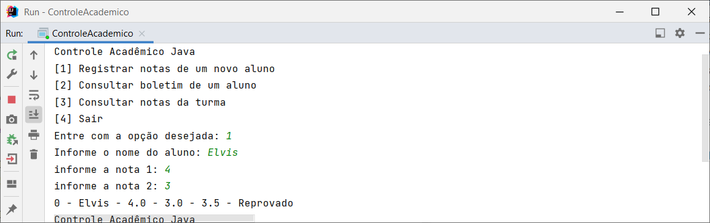

# Fundamentos do Desenvolvimento Java 
## Teste de Performance - TP1 
#### Elvis Lopes

### Escopo

Construir um programa simples para o controle acadêmico de uma instituição de ensino

* Ao ser iniciado, o programa deve exibir um menu com as seguintes opções:

  [1] Registrar as notas de um novo aluno.
  [2] Consultar boletim de um aluno.
  [3] Consultar notas da turma.
  [4] Sair.

* A estrutura de dados do programa consiste em três vetores com 100 posições cada.
* Quando um novo aluno for registrado, o programa deve verificar qual a próxima posição a ser ocupada nos vetores. Se todas as posições forem ocupadas, o programa deve informar ao usuário uma mensagem informando sobre a impossibilidade de inserir novo registro.
* Caso a opção 2 seja escolhida, então o programa deve solicitar ao usuário o código informado no registro do aluno para que ele possa ser consultado. O programa deve exibir na tela o nome e as notas do aluno, além da média final e da situação do aluno. Se a média entre as notas da AV1 e da AV2 for:

  Inferior a 4, imprimir a situação "Reprovado";
  Igual ou superior a 4 e menor que 7, imprimir a situação "Prova final";
  Igual ou superior a 7, imprimir a situação "Aprovado".

* Se a opção 3 for escolhida no menu do programa, então o programa deverá imprimir na tela todos os alunos, seguindo as mesmas condições para impressão do boletim, exceto pelo fato de que o programa não deve solicitar o código, já que vai imprimir todos os registros.

### Aplicação em execução

Inserindo aluno reprovado

Inserindo aluno em prova final

Inserindo aluno aprovado

Acessando boletim de um aluno

Relatório de notas da turma

Saindo da aplicação

